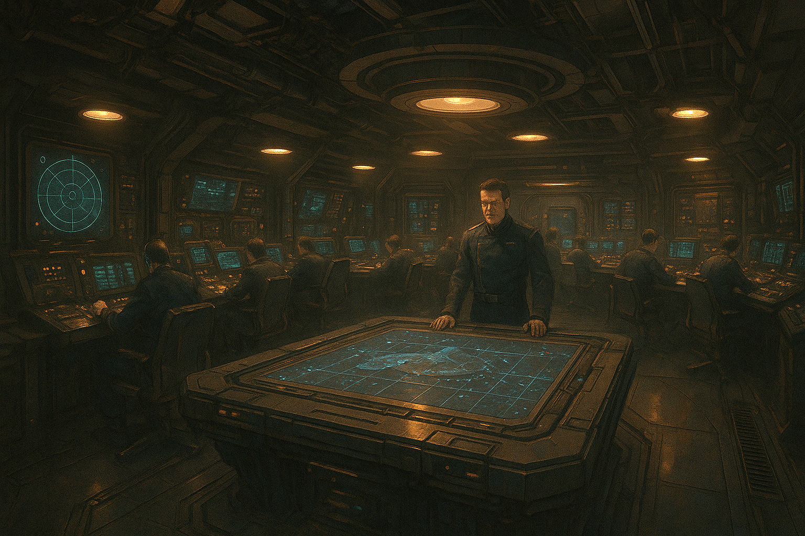
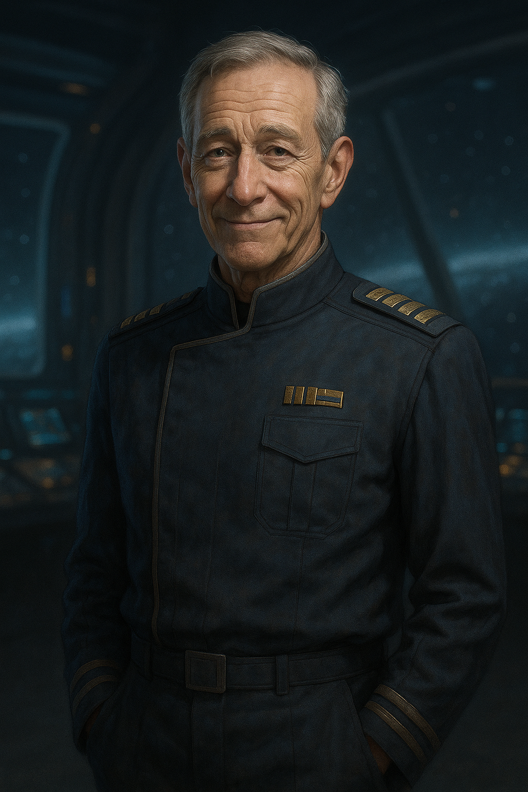
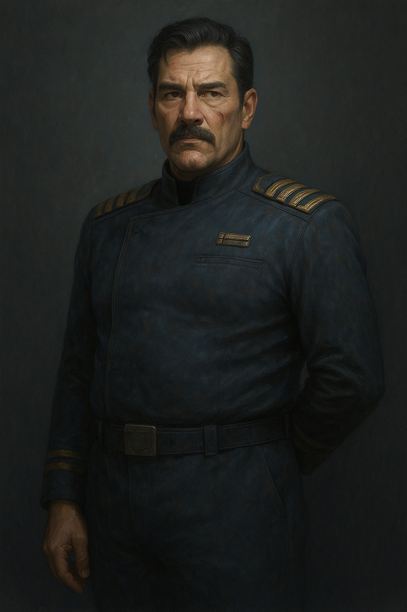

# The T.N.C. Theseus
---
> **"Nothing"** is the **absolut absence** in which there there can be **no time**, **no motion**, **no entropy**, **no awareness** and not even the ability of **self-observation**.
---

## Chapter 1

> **Aboard the T.N.C Theseus**
>
> Command and Communication Center - **"The C.C.C."**

*The lights above the command table glowed a soft amber, casting long shadows across the matte-black consoles. The air buzzed with low radio traffic, muted and layered—a half dozen operations running in parallel, all feeding back to this room. Around the walls, stations pulsed with radar sweeps, system checks, and pilot telemetry. Fingers moved across interfaces with practiced ease, but no one was speaking.*

*Captain John Radek stood at the edge of the central table, arms crossed behind his back, his gaze fixed on the holoscreen hovering just above the table’s surface. On it: the combat drill was nearing its end. Fighter blips darted around a simulated target, labeled in red.*

*The comms crackled to life, flooding the C.C.C. with the layered chatter of fighter pilots executing their final maneuvers around the Theseus.*

- "Witch to all fighters—form up on me. Three bogeys remaining. Theseus Actual, can you confirm?"

- "Theseus Actual here. I confirm three radar bogeys remaining—grid coordinates Kappa-19 by Theta-42. They’re holding current formation. I repeat: formation and heading unchanged."

- "Hound here—I'm in position, right behind you, Witch."

- "Startrail—coming up on your left flank.”

- "Seahorse—holding formation on your right, Witch."

- “Witch to Theseus Actual,” *Rhea Kovarik relayed to the C.C.C.*, *her voice calm but resolute*. “We’re on course to intercept the remaining bogeys.”
*She switched channels, addressing her squadron directly.*
“Alright, team—let’s finish this. Weapons hot. Stay tight and stay smart.”

- “Seven enemy craft down—taken out by just four pilots,” *X.O. Haraldson said, breaking the silence in the C.C.C.* *He glanced at the tactical display, then back at the Captain.* “Those nine months of combat simulations are finally starting to pay off, sir.”
---
> 
> X.O. Leif Haradlson
---
- “They broke formation!” *Hound nearly shouted.* “They’ve split!”

- “Startrail, you’re with Hound. Engage the two-bogey group,” *Witch commanded, her voice steady with an eerie calm.* “Seahorse—on me.”

- “On it, boss,” *Hound replied.* “Startrail, we go in parallel—break on contact.”

- “Aye aye, sir,” *Seahorse acknowledged,* locking into position beside Witch.

- “Actual, relay a message to the fighter squadron,” *Captain Radek said, his rugged voice filling the room with calm authority.* “Tell them: by the numbers.”
---
> 
> Captain John Radek of the T.N.C. Theseus.
---
- “Actual to Witch—direct message from the Captain,” *the comms officer echoed.* “By the numbers.”
