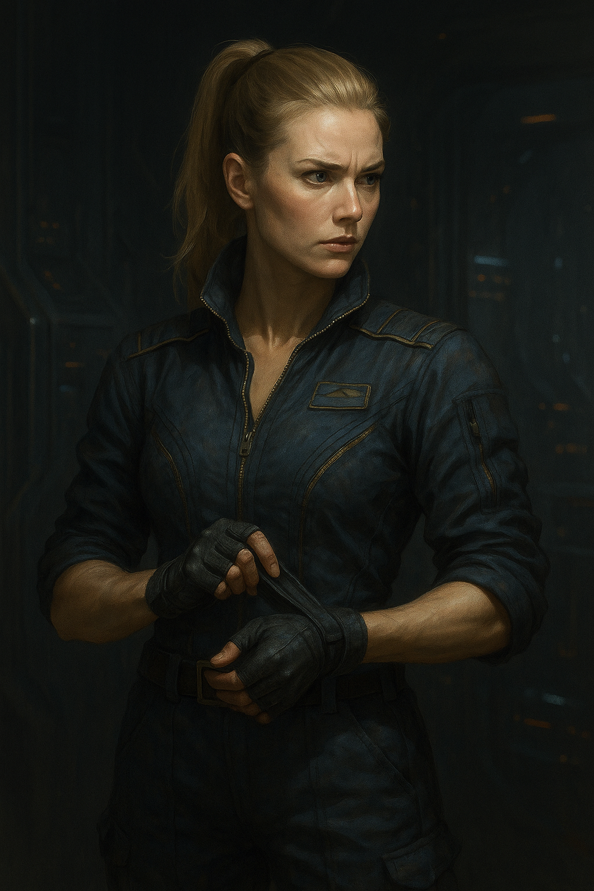

# From Darkness: The Odyssey of Theseus
---
> **"Nothing"** is the **absolut absence** in which there there can be **no time**, **no motion**, **no entropy**, **no awareness** and not even the ability of **self-observation**.
---

## Chapter 1

> **Aboard the T.N.C Theseus**
>
> Command and Communication Center - **"The C.C.C."**

*The lights above the command table glowed a soft amber, casting long shadows across the matte-black consoles. The air buzzed with low radio traffic, muted and layered—a half dozen operations running in parallel, all feeding back to this room. Around the walls, stations pulsed with radar sweeps, system checks, and pilot telemetry. Fingers moved across interfaces with practiced ease, but no one was speaking.*

*Captain John Radek stood at the edge of the central table, arms crossed behind his back, his gaze fixed on the holoscreen hovering just above the table’s surface. On it: the combat drill was nearing its end. Fighter blips darted around a simulated target, labeled in red.*

*The comms crackled to life, flooding the C.C.C. with the layered chatter of fighter pilots executing their final maneuvers around the Theseus.*

- "Witch to all fighters—form up on me. Three bogeys remaining. Theseus Actual, can you confirm?"

"Theseus Actual here. I confirm three radar bogeys remaining—grid coordinates Kappa-19 by Theta-42. They’re holding current formation. I repeat: formation and heading unchanged."

- "Hound here—I'm in position, right behind you, Witch."

- "Startrail—coming up on your left flank.”

- "Seahorse—holding formation on your right, Witch."

- “Witch to Theseus Actual,” *Rhea Kovarik relayed to the C.C.C.*, *her voice calm but resolute*. “We’re on course to intercept the remaining bogeys.”
*She switched channels, addressing her squadron directly.*
“Alright, team—let’s finish this. Weapons hot. Stay tight and stay smart.”

“Seven enemy craft down—taken out by just four pilots,” *X.O. Haraldson said, breaking the silence in the C.C.C.* *He glanced at the tactical display, then back at the Captain.* “Those nine months of combat simulations are finally starting to pay off, sir.”

---
> 
> X.O. Leif Haradlson
---
- “They broke formation!” *Hound nearly shouted.* “They’ve split!”

- “Startrail, you’re with Hound. Engage the two-bogey group,” *Witch commanded, her voice steady with an eerie calm.* “Seahorse—on me.”

- “On it, boss,” *Hound replied.* “Startrail, we go in parallel—break on contact.”

- “Aye aye, sir,” *Seahorse acknowledged,* locking into position beside Witch.

“Actual, relay a message to the fighter squadron,” *Captain Radek said, his rugged voice filling the room with calm authority.* “Tell them: by the numbers.”

---
> 
> Captain John Radek of the T.N.C. Theseus.
---
“Actual to Witch—direct message from the Captain,” *the comms officer echoed.* “By the numbers.”

- “Witch to Actual—understood. We stick to the book,” *Witch confirmed.*

- “Hound to Startrail—one’s got missile lock on me!” *his panicked voice crackled over the comms, echoing through the C.C.C.*

- “I’ve got him locked,” *Startrail responded calmly.* “M1 launched... target neutralized.”

*The C.C.C. stirred with sudden murmur—console operators whispering across  the workstations. X.O. Haraldson exchanged a glance with the Captain, a silent nod of approval passing between them.*

- “I’m in range to fire on Bogey Nine,” *Seahorse called out.* “Committed—punched him, but he’s still flying!”

- “Missile lock,” *Witch cut in sharply.* “M1 loose... target pacified.”

*The C.C.C. erupted once more—this time with hushed excitement rippling through the operators’ stations.*
“Rhea’s a damn good pilot,” *murmured a young woman at the telemetry console, loud enough for her colleague at Sensor Sweeps* — **and** *Captain Radek—to hear.*

*She didn’t need to turn her head to feel the Captain’s gaze settle on her.*

“My apologies, Sir,” *she said evenly, not rattled, but clearly aware.*

“Reports only,” *Radek said, his tone firm but not unkind.*

“Of course, Sir. My apologies, Sir. Won’t happen again, Sir.”

“Sir,” *the radar operator spoke quickly,* “last remaining bogey is retreating.”

- “Hound to Witch—requesting permission to pursue and destroy the target.”

- “Hound, do not even think about going in alone!” *Witch snapped, her voice iron-clad.* “Remember your training!”

- “Five by five, Commander,” *Hound replied, steady now.* “Acknowledged.”

“Bring them back,” *Captain Radek ordered, his tone composed but firm.* “And have each pilot submit a report explaining how the last bogey managed to maneuver into retreat.”
*He turned slightly toward the comms officer.*
“Tell Kovarik to report to the C.C.C. the moment she’s on deck.”

“Actual to all wings—return to the Theseus. Captain’s orders,” *the comms officer transmitted.* “I repeat: combat simulation terminated.”

*Moments later, the announcement echoed across the entire vessel—through hangars, corridors, and reinforced causeways:*

**“Stand down action stations. Stand down action stations. Combat simulation terminated.”**

*The voice reverberated through the ship like a calming tide, signaling the end of the drill.*

"All non-essential personnel, dismissed," *X.O. Haraldson ordered, his voice raised and firm, cutting through the ambient hum of systems and low chatter.*

*All console operators—except those manning radar and telemetry—stood up in near unison, saluted crisply, and made their way toward the exit of the C.C.C.*

“They still couldn’t intercept the last bogey before it broke and executed the retreat maneuver,” *Captain Radek muttered, sighing as he paced slowly around the central command table.*

“Well now, John,” *Haraldson added quickly, leaning lazily on one elbow across the edge of the table*, “you handpicked this crew yourself. You knew they were fresh meat. And still, Witch turned them from maggots into something that resembles a fighter squadron. You know damn well this last simulation’s hard—even for veteran pilots.”

“The problem, Leif,” *Radek said, stopping mid-step to lock eyes with his XO*, “is that I was told to choose from cadets. And I was told this stationing—on the edge of ORF space—was just a political showpiece while the diplomats danced.”
*He gestured slightly in the air between them.*
“We’ve been sitting here for almost a year. That tells me it’s not a show anymore.”

“Always the pessimist,” *Haraldson replied, dragging both hands down his face with a quiet groan.* “Always assuming the worst. Why do you make it your mission to stress me out like this?”

“Don’t you ever think about this?” *Radek asked, leaning forward and planting both hands firmly on the command table between them.* “Don’t you feel something—some deeper layer to all of this?”
*He locked eyes with Haraldson.*
“Your instinct’s always been sharper than mine. What does it say now?”

“It tells me I need a big cup of coffee,” *Haraldson smirked, glancing sidelong at Radek.* “And so do you.”
*But the smile didn’t last and his tone shifted as his face turned grave.*
“But seriously… ever since the Great Sol War ended, and the ORF split off into that godforsaken Kuiper Belt, they’ve kept to themselves. No TPCs. No requests. Nothing. That was the deal.”
*He gestured toward the bow of the ship.*
“And for thirteen years, that deal held. Everyone was fine. No noise. No contact. Then one year ago…”
*He paused, the silence between them louder than before.*
“…they open a channel to the Terran Sol Union government.”
*Haraldson’s voice tightened with suspicion.*
“And now we’re sitting here—on ‘trade negotiations’ that have dragged on for almost a year?”
*He nearly shouted the last line at Radek, then immediately dropped his volume.*
“Yeah, John. I feel it too. Something ain’t right.”

*The door to the C.C.C. slid open before the XO could finish his last word.*

*Striding in with her usual confidence and a voice that needed no microphone*, *Rhea Kovarik declared:*
“Commander Kovarik callsign the Witch, reporting to the C.C.C. as requested, sir!”

---

> 
> Commander Rhea "Witch" Kovarik fighter division leader.

---

*Radek and Haraldson turned toward her, returning her salute with a nod and matching formality.*

“At ease, Commander,” *Haraldson said, gently, one eyebrow arching with faint amusement.* “Just give us the feedback on your squad’s progress.”

“They’re improving, sir,” Kovarik *replied without hesitation*. “After more than 600 hours in combat simulations, they damn well ought to. They’re starting to operate as a unit—but they still slip into cocky impulses. Like Hound earlier.”
*She folded her arms.*
“In a real engagement, they might panic at first. But I’ve got the leash tight. If they lose it, I’ll snap them back into line.”

*Radek frowned slightly.*
“Why did you feel the need to extend your feedback into a live combat scenario? The war ended thirteen years ago, Commander.”

*Haraldson glanced at Radek, a small knowing smile on his face—wordless confirmation that the unease wasn’t just in the command deck. It had seeped into every corridor of the ship.*

“With all due respect, Captain,” *Kovarik began, inhaling deeply as if bracing herself*, “we’ve been stationed here for almost a year. I haven’t heard a single new directive from either of you—aside from the daily combat simulations. We’re preparing for something. We don’t know what, or when—but everyone on this ship feels it in their bones.”

“Sounds like you’re complaining,” *Haraldson cut in sharply, stepping toward her.*

“No, sir,” *Kovarik snapped into proper posture*. “I’m stating facts. It feels like the TSU is preparing for an offensive against the ORF—and we’re the tip of the spear.”

“Let her be, Leif,” *Radek interjected, a wide smile creeping onto his face*. “She’s right to speculate. We haven’t given out any new instructions because we haven’t received any. Just: hold position.”
*He stepped past her, heading toward the exit.*
“Now, let’s get that coffee you’ve been whining about.”

The two men stepped out of the C.C.C., while Kovarik remained rooted in place—like a computer left mid-task with no further input.

"Are you gonna sleep there, Kovarik?" *the X.O.'s voice rang out, echoing through the chamber.*

"No sir! On my way, sir!" *the Witch replied in a raised, eager tone and immediately quickened her pace to catch up with the two men.*

*As they walked through hallways, bulkheads, and causeways, every crew member they passed stopped in their tracks to offer firm, respectful salutes. Kovarik was clearly elated to be seen walking beside the ship’s Captain and Executive Officer.*

*Radek could feel her pride—and he remembered. Fifteen years ago, during the Great Sol War, she had joined his crew as a fresh academy graduate. Back then, she dreamed of becoming a great pilot, though her confidence was brittle. She had lost her family and friends to a bombing raid on her home dome on Mars. The only reason she survived was because she was still in Navy school on Earth.*

*After that, she flew with fury. She wanted to avenge her loss, to protect others from the same fate. It was Haradlson who shaped her into the pilot she had become—a razor-sharp ace who had survived countless dogfights on skill, instinct, and sheer will alone.*

“Heh, I can smell the coffee already,” *Haraldson blurted out, suddenly picking up his pace as he saw the cantina doors.*

*Radek turned his head toward Kovarik, a wide grin spreading across his face.*
“He **really** wanted that coffee, it seems.”

*The Witch let out a laugh, light and genuine—and for a moment, Radek felt the weight on his shoulders lift. Just for a few seconds.*

“Come on, let’s grab a bite,” *he said, nudging Kovarik forward.*

*As they reached the cantina entrance, the shift in atmosphere was palpable. Inside, the moment the crew spotted the XO stepping in, there was the scrape of chairs on metal floors and a near-synchronized, firm:*

**“Sir!”**

*The same sharp reaction echoed through the cantina the instant the captain stepped through the door. Chairs scraped again, boots shifted, and voices rang out in near-perfect unison:*

**“Sir!”**

“At ease, everyone!” *Haraldson barked, cutting through the salute before it could fully form.*

*Radek, stepping in behind him, gave a small wave of his hand.* “Sit down, carry on.”
*Then, turning toward Kovarik with a warm but confident tone, he gestured toward a row of empty seats near the far bulkhead.*
“Pick a spot for us. I’ll hit the coffee machine. You want one too, I assume?”

“Yes, sir. I’d appreciate a mug of coffee,” *she replied quickly, already moving toward the empty table with a practiced step.*

*At the coffee machine, Radek and Haraldson kept quiet—a strategic silence between them, not born of fatigue or disinterest, but of intention. They were scanning the cantina, ears tuned to the undercurrent of gossip and murmured speculation. It wasn’t curiosity—it was reconnaissance. The mood of a ship, after all, could be taken better from whispers than from reports.*

*As Radek poured steaming coffee into two metal mugs, he caught fragments of a hushed exchange at a table just a few meters to the left—four marines hunched close, heads low.*

"I’m telling you, the ORF is planning revenge on the TSU for losing the w—"
*One of them was abruptly cut off by the marine across from him.*
"The Outer Ring Factions are humans too," *he said sharply.* "They deserve a place in the damn solar system. It’s big enough for all of us."

*Haraldson met Radek’s gaze. A single glance. A slight nod. The kind of subtle exchange that signaled agreement: the marine’s logic was... difficult to argue with.*

*Radek took a metal tray from the stack nearby and placed three coffee mugs side by side.*
“I’ll go with these to the table. You bring some sandwiches—or whatever they’ve got,” *he said over his shoulder.*

*Haraldson growled something unintelligible in response, the kind of grumble that walked the line between mock annoyance and affection. Radek smirked, balancing the tray as he made his way through the cantina*.

*As he walked carefully between the tables, another low conversation caught his attention—this time between two medical staff seated near the corner bulkhead.*

“I was with Seahorse yesterday,” *one of the doctors murmured, cheeks flushing pink*. “And I must say, I’m not disappointed.”

“Really?” *the other blinked, clearly surprised.* “I heard from a solid source he’s crushing hard on his lead.”

*Radek arched an eyebrow but didn’t slow his pace. As curious as he was about this girly gossip, his mission was clear. He reached Kovarik’s table and lowered the tray gently, setting the mugs down one by one without spilling a drop.*

“What’s on your mind?” *Radek asked gently, noticing Kovarik staring into a fixed point.*

*She didn’t look at him when she spoke.*
“Sir… do you remember? Thirteen years ago, the final minutes of the Sol War?”
*Her voice softened, the edges tinged with something between nostalgia and unease.*
“When we had our guns locked on the Neptunic Militia fighters… I still remember your voice, steady over the radio, keeping us calm. All of us, finger on the trigger, and you kept saying—‘Do not fire unless fired upon. Wait. Wait.’ Over and over.”

*Radek paused, his mug halfway to his lips. The memory hit him like a brief static charge*.
“Ah... yeah. I remember. Why bring that up now?”

“Bring what up?” *Haraldson’s voice cut in casually as he was taking a seat the table, placing a tray of sandwiches down with a familiar thud. He glanced between them, sensing something deeper had just passed beneath the surface.*

“Well,” *Radek said, looping Haraldson into the moment,* “our young squadron lead is feeling a bit nostalgic about the final minutes of the Sol War.”

“Ah… I see,” *Haraldson nodded as he slid into his seat, picking up on the weight in the air*. “What about it, Kovarik?”

*She stared into her coffee for a moment, then looked up, eyes steady*.
“I wanted to say… back then, I wanted to kill every last one of those bastards. Personally.”
*Her expression shifted—nostalgia giving way to the ghost of old rage, then cooling into blank calm*.
“But now… I keep trying to summon that same fire toward the ORF, and it’s just not there anymore. I don’t feel it. Not like I used to.”

*Radek shifted his gaze to Haraldson—an unspoken cue that this part of the conversation was the XO’s domain.*

*Catching the signal, Haraldson cleared his throat and leaned forward slightly.*
"Listen, Rhea," *he began, voice steady but softened*, "we’re all soldiers here. We follow orders. Even those guys in the Sol War... they were just following theirs."
*He looked down at his coffee mug, the steam swirling like faint ghosts of memory.*
"We all carry skeletons," *he said, more quietly now*. "That’s the life we signed up for. A soldier’s life. We live with it."
*Then he raised his eyes to meet hers.*
"The fact that your thirst for vengeance is gone—it doesn’t make you weak. It means you’ve learned to live again."

*Kovarik nodded slowly, her mouth parting to reply, but she was cut off by shouting from beyond the cantina door.*

"XO Haraldson! Sir, there’s a—XO Harald—!”
*A young lieutenant burst through the entrance, eyes wide, breath ragged as he scanned the room.*

“Message, sir! Urgent message from Navy Command!”

“I’m here, boy,” *Haraldson called out, standing halfway from his seat.* “What’s with the theatrics? Did you forget your training?”

“No, sir!” *the lieutenant straightened into a rigid posture, voice loud and crisp now.* “Message marked for immediate delivery to Theseus Command Staff. No delay permitted, sir!”

*Haraldson stepped forward, already extending a hand.*
“Dismissed, Lieutenant,” *he said calmly as he took the sealed paper*.

*Radek and Kovarik watched as Haraldson sat down heavily, the paper in hand. He huffed, puffed, and let out a low, animal growl from deep in his throat*.

**“It’s bad, John**,” *he muttered grimly, sliding the message across the table*. **“It’s very bad.”**

*Every eye in the cantina was locked on the command staff’s table. Conversations had ceased. Breaths were held.*

*Radek took the paper without a word and began reading—deliberately slow. He could feel the heat rising in his face, jaw tightening with each line.*

> **To the Theseus Command Staff,**
>
> Following the negotiations between the TSU and the ORF, the T.N.C. Theseus is hereby ordered to depart immediately upon receipt of this T.P.C.

> Coordinates: [KX-287.94 / 09°N - 132°W / 41.7 AU]
>
> Rendezvous with an Outer Ring Faction fleet is to occur at the specified coordinates. The purpose of this engagement is to ensure the safe escort and extraction of all vessels currently within ORF territory at that location. 
>
> Intelligence reports indicate the destruction of multiple ORF ships and stations by an unidentified vessel not originating from the Sol system.

> Departure is to be confirmed via T.P.C. with Navy Command and executed without delay.
>
> **Godspeed.**
